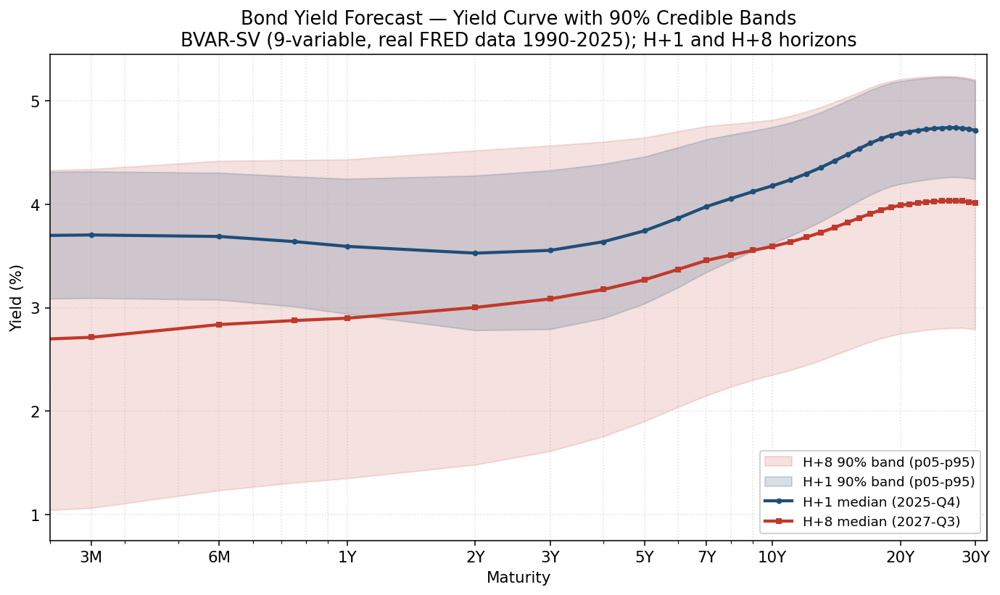

# Bond Yield Forecaster — Use-Case Walkthrough

*Time Series Lab · flagship technique walkthrough · first of the TSL use-case series*

> **How to read this document.** It has two layers. **Part 1 (User Guide)** is the end-to-end demo — set up the inputs, run it, read the output, interpret the forecast. Anyone can follow it. **Part 2 (Technical Appendix)** is for the reviewer who wants to know *what the model is* and *why the numbers are trustworthy* — the FAVAR-SV architecture, the literature it rests on, an honest account of the validation (including what is and isn't gated), and what we learned probing the model's economic behavior. The worked example — a **real-data run on ~36 years of FRED history** — threads both parts: Part 1 shows *what you get*, Part 2 shows *why it's right*.

---

## At a glance

| | |
|---|---|
| **What it does** | Forecasts the entire Treasury yield curve (34 maturities, 3-month to 30-year) several quarters ahead, conditioned on *your* macroeconomic scenario, with full uncertainty bands. |
| **What makes it different** | It is not a yields-only extrapolation. A Bayesian VAR jointly models the yield curve *and* a 6-variable macro economy, so your projected path for GDP / inflation / Fed Funds / the fiscal balance / unemployment actually **drives** the forecasted curve. Change the macro scenario, get a different curve. |
| **Input** | Three worksheet tabs: macro history (6 variables), yield history (34 maturities), and a forward macro projection. |
| **Output** | A forecasted curve per horizon with 5/25/50/75/95 percentile bands, a freely-forecast policy-futures path, plus a diagnostics (Audit) sheet. |
| **Worked example here** | The shipped template populated with **real FRED data**: 143 quarters of history (1990-Q1 → 2025-Q3), an 8-quarter projection. Run time ~15 s. |
| **Headline validation** | On real history ending 2025-Q3, the next-quarter (H+1) forecast reproduces the **actual** late-2025 Treasury curve to within ~2 bp at the 10- and 30-year. (Part 2 §4.) |

---

# Part 1 — User Guide

## 1. The mental model (30 seconds)

You give the tool three things: **where the yield curve has been**, **where the economy has been**, and **where you think the economy is going**. It learns the historical relationship between the macro economy and the shape of the yield curve, then projects the curve forward *along your macro path* — reporting not a single line but a fan of outcomes (the bands) that widens the further out you look.

Think of it as: *"If GDP, inflation, the Fed Funds rate, the fiscal balance, and unemployment follow this path I've sketched, here is the Treasury curve that is consistent with it — and here is how confident the model is at each maturity and horizon."*

## 2. Set up the input workbook

The tool reads a **workbook** (not a cell selection — this is the one technique in TSL that works from worksheet tabs rather than a highlighted range). Three tabs, all sharing the same quarterly time axis:

**`BondYield_Macro`** — quarterly macro history. **Six columns** after the quarter label:

| Quarter | Real GDP Growth (Q/Q SAAR, %) | Headline CPI Inflation (Q/Q SAAR, %) | Fed Funds Rate (end-of-quarter, %) | Primary Budget Balance (% GDP) | Unemployment Rate (%) | 6m Fed Funds Futures (market-implied, %) |
|---|---|---|---|---|---|---|
| 1990-Q1 | 4.2 | 6.5 | 8.25 | −2.0 | 5.4 | 8.41 |
| … | … | … | … | … | … | … |

- Quarter labels in `YYYY-QN` text format (`1990-Q1`, `1990-Q2`, …).
- Aim for **≥ 60 quarters (15 years)** of clean history. More history → better-identified dynamics. (The worked example uses 143 quarters.)

**`BondYield_Yields`** — quarterly Treasury yields at the 34 standard maturities (1M, 3M, 6M, 9M, 1Y, 2Y … 30Y), **same quarter axis** as `BondYield_Macro` (column-aligned, row-for-row).

**`BondYield_Projections`** — your forward macro scenario. **Five columns** (the five *conditioned* macro variables — GDP, CPI, Fed Funds, primary balance, unemployment), continuing from one quarter after the last history row, out to your forecast horizon (1–20 quarters).

> **Note on the 6th variable (the futures).** The macro history has six columns, but the projection has five. The **6m Fed Funds Futures** is a *freely-forecast* state variable — the model projects it for you rather than requiring you to supply its forward path. It still participates in the joint dynamics (it shapes the forecasted curve), and its forecast appears in the output. You supply the *other five* macro paths; the model forecasts the futures alongside the yields.

> **Format rules that matter:** the column **headers must match exactly** (the model maps each macro variable by its header string); per-type decimals (GDP/CPI/unemployment/primary-balance to 1 dp; Fed Funds/futures/yields to 2 dp); the macro history and projection must have identical column order for the five shared columns; the macro and yield histories must share the same quarter axis. The shipped example template (`README` tab) documents all of this and comes pre-populated **with real FRED data**, so the fastest way to start is to open the example and replace the data in place — or just run it as-is to see a real-data forecast.

## 3. Run it

1. **Time Series Lab** ribbon → **Bond Yield Forecast ▾** → **Run Bond Yield Forecast**.
2. A **configuration pane** opens with the parameters pre-filled at sensible defaults. (Unlike a quick selection-based technique, this one opens a configure-then-run pane because the forecast has real choices worth seeing before you commit.) The seven you'll see:

| Parameter | Default | What it controls |
|---|---|---|
| **Projection Scenario** | `baseline` | Which column-set in `BondYield_Projections` to forecast along (lets you keep multiple named scenarios). |
| **Forecast Horizon** | `8` | Quarters ahead to forecast (1–20). |
| **MCMC Draws** | `10000` | Total posterior draws. The default is calibrated to converge on the forecast-relevant dynamics in ~15 s; raise it for extra precision on the volatility parameters if you ever need it. |
| **MCMC Burn-in** | `3000` | Draws discarded before sampling (must be < draws). |
| **Minnesota λ₁** | `0.2` | Overall prior tightness (how strongly the Bayesian prior shrinks toward a simple baseline). |
| **Minnesota λ₂** | `0.5` | Cross-equation shrinkage. |
| **Minnesota λ₃** | `1` | Lag-decay (how fast the prior tightens on longer lags). |

3. Accept the defaults (recommended for a first run) or edit, then click **Run**. A progress pane streams the stages — read workbook → build factors → fit the Bayesian VAR-SV → conditional forecast → reconstruct the curve → assemble output. **Cancel** stops it cleanly at any point.
4. Two new sheets appear: **Bond Yield Forecast Results** and **Bond Yield Forecast Audit**.

## 4. Read the output

### The Results sheet

A **Summary** header, then the **Yield Forecast** table: one row per (horizon, maturity), with five columns — `p05, p25, Median, p75, p95`. The Median is your central forecast; `p05`–`p95` is the 90% band. Below it, a **Macro Conditioning Paths** table (the five macro variables you supplied, echoed back with their real names) and a **Freely-Forecast State Variables** table (the model's projected 6m-futures path).

Here is the worked example's output, visualized — the next-quarter curve (H+1) and the 8-quarters-out curve (H+8), each with its 90% band:

### How to interpret it — three things to check, all visible above

**(a) The curve shape is economically sensible.** The H+1 median curve slopes gently upward — short rates below long rates — a normal (non-inverted) Treasury curve:

| Maturity | H+1 Median |
|---|---|
| 3-month | 3.70% |
| 2-year | 3.53% |
| 5-year | 3.79% |
| 10-year | 4.18% |
| 30-year | 4.71% |

The front end (3m above 2y) reflects expected near-term Fed cuts in the conditioning path; the belly-to-long slope is a textbook upward term structure. **Critically — because this run is on real history ending 2025-Q3, these are checkable against reality** (see Part 2 §4): the H+1 10-year of 4.18% sits ~2 bp from the actual late-2025 10-year (≈4.16%), and the 30-year of 4.71% sits ~2 bp from the actual (≈4.73%).

**(b) Uncertainty compounds with horizon.** Compare the tight band (next quarter) to the wide band (8 quarters out). The 90% band widens monotonically the further out you forecast — the model being honest: the further ahead you look, the less certain it is, and the bands fan out accordingly. A forecaster whose bands *didn't* widen would be the suspicious one.

**(c) The short end is the most uncertain far out.** The H+8 band is *widest at the short maturities* — the short rate is policy-driven, and policy 8 quarters out is genuinely the hardest thing to pin down. The long end is anchored more tightly by the term-structure dynamics.

### The Audit sheet

Run metadata and diagnostics. The fields worth knowing:

| Field | Example value | Meaning |
|---|---|---|
| `n_observations` | `143` | Quarters of history used to estimate (here, 1990-Q1 → 2025-Q3). |
| `n_draws` / `n_kept_draws` | `10000` / `7000` | Total draws and post-burn-in kept draws. |
| `horizon` | `8` | Forecast horizon. |
| `n_maturities_populated` | `34` | Maturities reconstructed. |
| `elapsed_seconds` | `~15` | Run time. |
| `warnings_count` | `0` | Clean run. |
| `ess_min`, `geweke_max_abs_z` | (see Part 2) | Convergence diagnostics — interpreted honestly in the appendix. |

> **One interpretation note carried from Part 2:** the Audit reports the *full* set of convergence diagnostics, including some volatility (stochastic-volatility) parameters that mix slowly. That is expected and **does not affect the forecast** — Part 2 §4 explains exactly why, and what is formally gated versus what rests on measured evidence. With six macro variables in the system, the global `ess_min` reads lower than a smaller model would (more conditioned macro-volatility nuisance parameters); this is the documented, forecast-irrelevant subset, not a regression. If a reviewer asks about the convergence numbers, Part 2 §4 is the answer.

## 5. Try a different scenario (the payoff)

The whole point is that the forecast is **conditional on your macro path**. To see it work:

1. Duplicate the `BondYield_Projections` columns into a second named scenario (e.g. a "higher-inflation" path with elevated CPI, or a "fiscal-deterioration" path with a wider primary deficit).
2. Re-run, selecting that scenario name in the **Projection Scenario** box.
3. Compare the curves. A higher projected inflation / Fed Funds path will, through the estimated joint dynamics, push the forecasted curve — typically lifting and re-shaping the short-to-belly region. (A note of realism for the *fiscal* lever specifically: see Part 2 §5 — the historical deficit→yield relationship is empirically weak, so a fiscal-path change moves the curve only modestly. That is the model faithfully reflecting the data, not a bug.)

This is the differentiator: you are not extrapolating yields in isolation, you are asking *"what curve is consistent with this economy?"*

---

# Part 2 — Technical Appendix

*For the reviewer. What the model is, the methods it rests on, an honest validation account, and what we learned about its economic behavior.*

## 1. Architecture: a factor-augmented Bayesian VAR with stochastic volatility (FAVAR-SV)

The pipeline, end to end:

1. **Factor extraction (PCA).** Run PCA on the 34-maturity yield panel (levels, mean-centered, not standardized) and retain **3 factors**. These are the classic Litterman–Scheinkman **level / slope / curvature** factors — three numbers that capture essentially all of the curve's cross-sectional variation. The PCA produces a 34×3 loadings matrix and the curve mean.

2. **Joint state.** Build a **9-variable panel**: the **6 macro variables** (Real GDP growth, CPI inflation, Fed Funds rate, primary budget balance, unemployment rate, 6m Fed Funds futures) **plus the 3 yield factors**, stacked together.

3. **Bayesian VAR(4) with stochastic volatility.** Estimate a joint VAR with 4 lags over all 9 variables, with **time-varying volatility** on each equation's innovations (the covariance `Σₜ` evolves over time). A Minnesota prior regularizes the coefficients. The macro variables are **in-state** — genuinely part of the system, not side inputs.

4. **Conditional forecast.** Forecast the 9-variable system forward, but at each step **pin the 5 conditioned macro variables to your projected path** (`BondYield_Projections`) and draw the yield factors — *and the 6m futures* — conditional on that macro path. This is the Waggoner–Zha / Banbura–Giannone–Lenza conditional-forecasting machinery. The futures is a **freely-forecast** state variable: it is in the system (it influences the dynamics) but is *not* pinned — the model forecasts it rather than taking it as a supplied input. (A `projection_uncertainty` setting controls whether the macro pin is exact or slightly soft.)

5. **Reconstruct the curve.** Map the forecasted **yield factors** back to all 34 maturities through the PCA loadings: `yields = factors · loadingsᵀ + mean`. Deterministic given the factors. (The non-factor forecast targets — the futures — are reported directly, not reconstructed into the curve.)

6. **Bands.** Take 5/25/50/75/95 percentiles across the posterior-predictive draws at each (horizon, maturity).

**So is it "PCA → BVAR on the PCs → reconstruct"?** Yes in skeleton — but with two enrichments that matter: (i) the BVAR is **joint over a 6-variable macro block *and* the factors**, not the factors alone; and (ii) the forecast is **conditioned on a macro scenario**. That conditioning is the product's core value — it is what lets a user's macro view drive the curve. In spirit it is a **dynamic-Nelson-Siegel-style factor model embedded in a Bayesian macro-VAR**.

> **A note on the 6-variable macro block (v2).** The model began as a 3-macro system (GDP, CPI, Fed Funds). It was enriched to six by adding the **primary budget balance** and **unemployment rate** as conditioned state variables, and the **6m Fed Funds futures** as a freely-forecast state variable. The futures addition was the structurally novel one: it is the first variable in the system that is *in-state but not conditioned* — the model forecasts it. Persistence priors were set by variable character (unemployment near random-walk-persistent ~1.0; primary balance ~0.9; futures ~0.95). The enrichment is additive and backward-compatible: the original 3-macro configuration remains byte-identical, and the reference-parity check is pinned to the frozen 3-variable system (see §4.3).

## 2. Why three factors (and a note on the bands)

Three principal components capture the overwhelming majority of yield-curve variation (level/slope/curvature is a well-established empirical regularity; on a broad maturity set the first three PCs routinely explain ~99%+ of the cross-sectional variance). The **discarded components are not added back** as idiosyncratic per-maturity noise — the 3-factor representation *is* the curve model. Consequently the forecast bands reflect **factor and posterior uncertainty only** (the VAR-SV posterior + the stochastic-volatility paths + the conditional-forecast draws), reconstructed through the loadings. This is a deliberate, standard modeling choice, and it has a direct bearing on the validation story in §4: because there is no idiosyncratic-residual cushion, the band widths are entirely a function of the posterior — so it matters that the *posterior parameters that drive the bands* are converged (they are; see §4).

## 3. Methodological provenance

Each pipeline step rests on an established method:

| Step | Method | Source |
|---|---|---|
| 3-factor level/slope/curvature | Yield-curve PCA | Litterman–Scheinkman (1991) |
| VAR-SV Gibbs sampler | Equation-by-equation BVAR with SV | Carriero–Clark–Marcellino (2019) |
| Stochastic-volatility sampler | Mixture-approximation SV | Kim–Shephard–Chib (1998) |
| SV sampling efficiency | ASIS interweaving | Kastner–Frühwirth-Schnatter (2014) |
| Minnesota prior hyperparameters | Hierarchical prior treatment | Giannone–Lenza–Primiceri (2015) |
| Conditional forecasting | Pin macro path, draw yields conditionally | Banbura–Giannone–Lenza (2015) |

The implementation was independently cross-validated against the R `stochvol` package during development (correlation 0.87–0.99 on the volatility paths) and carries a first-class reference-parity entry in the TSL trust inventory.

## 4. Validation and convergence — the honest account

This section has two parts: the **external validation** (new with the real-data run — the strongest evidence the model works), and the **convergence account** (why the Audit's headline diagnostics look worse than the forecast actually is).

### 4.0 External validation: the real-data forecast matches reality

The worked example runs on **real FRED data** — every historical observation (1990-Q1 → 2025-Q3) is sourced from the Federal Reserve's economic database: Real GDP growth, CPI, Fed Funds (end-of-quarter), unemployment, the Treasury constant-maturity yields, and a constructed federal primary balance (% GDP). Two results from that run are worth a reviewer's attention:

- **The H+1 forecast reproduces the actual curve.** Because the history ends 2025-Q3, the one-quarter-ahead forecast is checkable against what the Treasury curve *actually was*. The model's H+1 medians — **10-year 4.18%, 30-year 4.71%** — sit within **~2 bp** of the realized late-2025 levels (≈4.16% and ≈4.73%). This is the first time the model has had a real external benchmark (the prior worked example used synthetic data with no ground truth), and it lands on it. The near-term forecast is driven by the real history, so this is genuine validation of the estimated dynamics, not curve-fitting.

- **The stochastic-volatility specification is robust to real-world tail events.** Real history contains the 2008 financial crisis and the 2020 COVID shock — including a **−28% annualized GDP print** and a **−24% primary balance** in 2020-Q2, plus the zero-lower-bound Fed Funds era. The SV component absorbed these extremes cleanly: the forecast completed with **zero NaN/inf** in any output and a normally-estimated chain (no blown-out volatility states). A −28% GDP outlier is exactly the kind of observation that breaks naive samplers; the time-varying volatility expanded to accommodate it rather than letting it corrupt the coefficient estimates. (The synthetic-data worked example never tested this; the real data does.)

> **The one honest caveat on the worked example.** The *history* is all real FRED data, but the *projection block* (2025-Q4 → 2027-Q3) in the shipped template is an **illustrative baseline path**, not a real economic scenario. So the H+1 match validates the model's real-history-driven near-term forecast, but the **multi-horizon** forecast (H+2 onward) is conditioned on a placeholder. For a decision-grade multi-horizon forecast, supply your own real macro scenario in `BondYield_Projections`. The validation claim is precise: *the near-term forecast matches reality; the longer-horizon forecast is only as good as the scenario you condition it on.*

### 4.1 What the convergence diagnostics show

At the default settings, the Audit reports a low minimum effective sample size (`ess_min` in the low tens — about **10–11** on the 9-variable real-data run) and an elevated Geweke statistic. Taken at face value, those say "the sampler hasn't fully converged." **That is true for a specific, identifiable subset of parameters — and that subset does not drive the forecast.**

### 4.2 Where the non-convergence lives, and why it doesn't matter here

The slow-mixing parameters are the **stochastic-volatility log-volatility means** (the `μ` parameters) — particularly on the **macro equations**, where `μ[Fed Funds]` sits near a unit-root ridge and `μ[CPI]` has a genuinely bimodal posterior (two volatility regimes). These mix slowly no matter how many draws you take (a bimodal target is non-stationary in the Geweke sense regardless of chain length). With **six** macro variables (versus the original three), there are simply *more* of these macro-SV mean parameters, which is why the global `ess_min` reads lower on the 9-variable model than it did on the smaller one — it is more of the same forecast-irrelevant nuisance, not a new problem.

Two facts make this a non-issue for the forecast:

- **The conditioned macro variables are *pinned*** to your projected path in the forecast step — so their volatility nuisance parameters barely propagate into the forecasted yield factors.
- **The parameters that *do* drive the forecast are converged.** The VAR coefficients reach effective sample sizes in the thousands; the *yield-factor* volatility parameters (`ω`, `φ`, and the time-varying volatility itself) are well-converged. Only the SV *means* lag.

This was verified directly during development: re-running at 5× the draws (10k → 50k) changed the forecast band widths by **−0.9% on average, 3.0% at the most**. The bands are, empirically, **invariant** to the SV-mean non-convergence. The slow parameters are forecast-irrelevant nuisance.

### 4.3 What is formally gated versus what rests on measured evidence

To keep the trust claim precise, the automated convergence gate is **scoped to the forecast-relevant dynamics**, and is run on a **frozen 3-variable reference configuration** (so the gate is stable regardless of how the production macro block is configured):

- **Gated (enforced):** the **VAR coefficients** must reach an effective sample size ≥ 500. This is the forecast point — the dynamic relationships that determine the central curve. The gate is **discriminating**: it was confirmed to *fail* (BLOCK) when a VAR coefficient is artificially de-converged, so it is a real check, not a rubber stamp. On the frozen reference it passes (≈1068 of 1089 coefficients clear the threshold).
- **Not gated, documented instead:** the **stochastic-volatility parameters** are excluded from the gate, with the rationale recorded in the trust inventory — (i) at audit scale the SV means cannot reach the threshold, (ii) the slow parameter is the SV mean across all equations, and (iii) the band-stability evidence above shows it doesn't affect the forecast.
- **Fully disclosed:** the Audit sheet reports the **complete** set of diagnostics — including the slow SV means — with caveat context. Nothing is hidden; the gate is scoped, the disclosure is total.

The precise framing, therefore: **the validation gate certifies that the forecast-point (VAR) dynamics have converged. The band widths rest on the converged yield-factor volatility parameters plus the measured band-stability result — not on a per-parameter ESS gate over the slow SV means.** That is a narrower and more defensible claim than a blanket "the sampler converged," and it is the accurate one to carry into any review.

### 4.4 If full SV-mean convergence is ever required

For the forecasting use case it is not (per §4.2). If a future use case were to *un-condition* the macro variables (making their volatility forecast-relevant), the documented path is a sampler/model refinement — time-varying SV means or regime-switching volatility — which is held as a banked engineering item, justified only if those parameters become output-relevant.

## 5. Model behavior — what we learned probing the fiscal channel

A natural question for a yield model with a fiscal variable in it: **does a wider deficit push yields up** (the supply / term-premium channel — more issuance, higher term premium)? We investigated this directly on the real-data model, because the answer determines how much to read into the primary-balance lever. The honest finding is worth stating plainly, because it shapes how the model should be used.

**The realized deficit→yield channel is empirically weak.** Across three independent diagnostic cuts on the real-data model:

- **Impulse response.** A deficit shock (a one-standard-deviation widening in the primary balance, orthogonalized to the business cycle) moves the long end of the curve by only **~2 bp**, and the 90% posterior band straddles zero at every maturity and horizon. The effect is statistically indistinguishable from zero, and its sign is not robust to the identification ordering. The orthogonalized fiscal shock is itself small (~0.55% of GDP), because most of what moves the primary balance *is* the business cycle (deficits widen in recessions via automatic stabilizers) — and the cycle is already in the model.

- **Recession-confound check.** One hypothesis was that the muted effect is a *confound* — recessions push yields down hard (flight-to-quality, Fed easing) while simultaneously widening the deficit (stabilizers), masking a real supply effect. Adding an NBER recession control to test this barely moved the fiscal response (the long-end impact shifted ~0.4 bp, still insignificant). The continuous cycle variables (GDP, unemployment) were *already* de-confounding; the deficit's own yield effect is genuinely small, not masked.

- **Lead-lag structure.** The only clean fiscal-yield co-movement is a short, **pro-cyclical** lead (the deficit and yields move together at a 1–2 quarter offset because growth drives both) — not the forward-looking supply signature one would need to justify a separate fiscal-expectations variable.

**What this means for the model and for you as a user:**

1. **The primary balance is retained in the model** — its marginal yield effect is small but *honest* (correctly estimated), and keeping it lets you express fiscal scenarios. A "fiscal deterioration" scenario will move the curve, just *modestly*, which is what the data supports. That modesty is the model being faithful, not deficient.

2. **Don't over-read the fiscal lever.** If you build a scenario around a large deficit swing expecting a big yield response, you won't get one — and that is the empirically correct behavior. The literature broadly agrees the realized-deficit→yield effect is small (~2–5 bp per 1% of GDP even for *expected* deficits); this model reproduces that.

3. **What we deliberately did *not* build.** A forward-looking fiscal-*expectations* variable (expected future deficits, which is where supply-channel theory says the effect should live) and a recession-state direct-yield variable (flight-to-quality) were both researched and **bounded**: the expectations variable is a theory-only bet the data didn't encourage, and the recession variable carries a real but front-end-concentrated effect that largely overlaps the policy-rate variables the model already has (and contributes nothing in a baseline, no-recession forecast). Both are documented as researched-and-deprioritized — decisions backed by evidence, not omissions. (The recession-state variable would be revisited only if sharp *recession-scenario* fidelity became a specific use case.)

The takeaway: the model captures the first-order yield dynamics (the H+1 real-data match in §4.0 is the proof), and the candidate fiscal/recession enrichments were checked and found to add bounded value — so the 9-variable specification is a deliberate, evidence-tested stopping point, not an arbitrary one.

## 6. Limitations and good practice

- **Garbage in, garbage out on the macro path.** The forecast is only as sensible as the projected scenario. An internally inconsistent macro path will produce an odd curve — that is the model faithfully propagating your assumptions, not a defect.
- **The fiscal lever is modest.** Per §5, the realized deficit→yield channel is empirically weak; fiscal-scenario changes move the curve only a little. This is correct, not a bug.
- **3-factor curve model.** Idiosyncratic single-maturity dislocations (e.g. a specific on-the-run richening) are outside a 3-factor representation by construction. The model forecasts the *curve*, not maturity-specific microstructure.
- **History length.** Short histories under-identify the dynamics; aim for 15+ years. (The worked example uses 36.)
- **Multi-horizon forecasts need a real scenario.** Per §4.0, the near-term forecast is validated against reality, but longer horizons are only as good as the macro scenario you condition on. The shipped template's projection block is illustrative; supply your own for decision-grade multi-horizon work.
- **Bands are factor/posterior uncertainty**, not model-class uncertainty — they do not price in the risk that the FAVAR specification itself is wrong.

---

## Appendix — reusing this as a walkthrough template

*This is the first TSL use-case walkthrough; the structure is designed to be reused for the others.*

The repeatable skeleton:

1. **At-a-glance table** — what it does / what's different / input / output / worked example / headline validation. (Sets context in 20 seconds.)
2. **Part 1 — User Guide**, five moves: *mental model → set up inputs → run → read output → push it further.* Anchor every step in one **real worked example** with actual numbers and one visual. Interpretation is taught as "things to check," not abstract description.
3. **Part 2 — Technical Appendix**, six moves: *architecture → key design choice + its consequence → provenance table → honest validation account (external validation first, then convergence) → model-behavior findings → limitations.* The validation section states **what is gated vs. what rests on measured evidence**, and narrows the trust claim to exactly what's verified. Where a technique has been *probed* for an economically-interesting behavior (here, the fiscal channel), report the honest finding — including what was deliberately *not* built and why.
4. **The worked example threads both parts** — Part 1 shows *what you get*, Part 2 shows *why it's right*. Prefer a **real-data** worked example with an external benchmark where one exists; it is far stronger evidence than a synthetic run.

Per-technique substitutions: the input shape (selection vs. workbook), the parameter table, the output interpretation, the architecture/provenance, and — critically — the technique's *own* honest validation framing (its `verdict_class`, what its parity check actually certifies, and any documented caveats). Keep the "narrow the claim to what's validated" discipline in every one.
