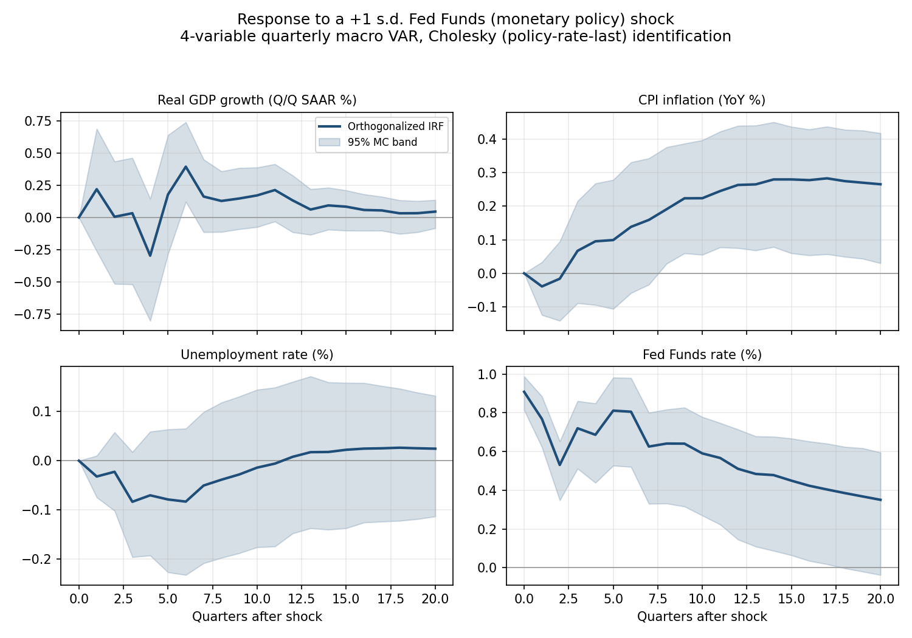

# Vector Autoregression (VAR) — Use-Case Walkthrough

*Time Series Lab · second of the TSL use-case series · the comprehensive VAR + structural-identification reference*

> **How to read this document.** It has two layers. **Part 1 (User Guide)** is the end-to-end demo — select your data, run it, read the impulse responses and variance decomposition, interpret what the model says about the economy. Anyone can follow it. **Part 2 (Technical Appendix)** is for the reviewer who wants to know *what the estimator is* and *why the numbers are trustworthy* — the statsmodels-plus-structural architecture, the four identification schemes and what each assumes, and an honest, scheme-by-scheme validation account. The worked example — a **real macro VAR on 70+ years of US quarterly data (GDP, CPI, Fed Funds, unemployment)** — threads both parts, and it is organized around a single question asked four ways: ***what does a contractionary monetary-policy shock do to the economy?*** Each identification scheme answers it differently, and the contrast between them is the whole point.

---

## At a glance

| | |
|---|---|
| **What it does** | Estimates a vector autoregression — a system where every variable is regressed on the lagged history of *all* the variables — then uses it to forecast, test directional causality (Granger), trace **impulse responses** (how a shock to one variable propagates through the system), and decompose **forecast-error variance** (how much of each variable's uncertainty each shock explains). |
| **What makes it different** | The reduced-form VAR is the workhorse, but the dynamics it captures are only *correlations* until you **identify** them structurally. TSL ships **four identification schemes** — Cholesky (recursive), Blanchard–Quah (long-run restrictions), proxy/IV (external instrument), and sign-restriction (set identification) — each imposing a different economically-motivated assumption to turn correlation into a causal shock. Most tools give you one. |
| **Input** | A highlighted range of **≥ 2 numeric columns** (a cell selection — this is a standard selection-based technique, not a workbook one). Each column is a variable; rows are the time axis. |
| **Output** | Forecast, model summary, coefficients, orthogonalized IRF, FEVD, IRF confidence bands, and — per identification scheme selected — the structural tables, plus Granger-causality tests. |
| **Worked example here** | The shipped **`macro_var.csv`** sample (load it in one click via Help → Sample Data → Multivariate): **286 quarters of US macro history, 1954-Q3 → 2025-Q4** — Real GDP growth, CPI inflation, Fed Funds rate, unemployment. These are the same four macro variables that anchor the BVAR Bond Yield Forecaster walkthrough (here on a year-over-year CPI basis), run now as a frequentist structural VAR. Run time a few seconds. |
| **Headline validation** | The reduced-form estimator is **bit-exact against R's `vars` package** at machine precision (10⁻¹⁵–10⁻¹⁶); the IRF confidence bands are validated cross-package against R `vars::irf` on band geometry; Blanchard–Quah matches R `vars::BQ` to machine precision. (Part 2 §5.) |

---

# Part 1 — User Guide

## 1. The mental model (30 seconds)

A VAR treats a handful of time series as a **single interconnected system**. Instead of modeling GDP on its own past, it models GDP on the recent past of GDP *and* inflation *and* the Fed Funds rate *and* unemployment — and does the same for every other variable simultaneously. The result is a compact description of how the variables move together through time.

That description, by itself, is **reduced-form**: it tells you the variables are correlated and how shocks *of the estimated mix* propagate, but it does not tell you what a *clean, economically-meaningful* shock — "an unexpected Fed tightening," say — does, because the estimated innovations are tangled together (a surprise jump in the Fed Funds rate is correlated with surprise moves in everything else). To untangle them you **identify** the system: you impose an assumption that lets you isolate one structural shock. The four schemes are four different assumptions, suited to four different questions:

- **Cholesky (recursive):** *"Assume a causal ordering — some variables can't react to others within the same period."* The workhorse.
- **Blanchard–Quah (long-run):** *"Assume some shocks have no permanent effect."* The natural lens for permanent-vs-transitory questions (supply vs demand).
- **Proxy/IV:** *"I have an external instrument correlated with the shock I care about."* The modern, credible-identification approach — when you have a clean instrument.
- **Sign-restriction:** *"I'll only assume the *direction* of a shock's effects, not the exact timing."* Set identification — the least restrictive.

This walkthrough runs all four on the same macro VAR, asking each: *what does a contractionary monetary-policy shock do?*

## 2. Set up the input

VAR reads a **cell selection** — highlight **two or more numeric columns**, each a variable, with rows as the time axis (a header row is fine). There is no special workbook layout; it is a standard selection-based technique.

**The worked example's data.** Load the shipped sample: **Time Series Lab** ribbon → (Help group) → **Sample Data** → **Multivariate** → **"VAR Data: US Macro Quarterly (GDP, CPI, FF, UNRATE)."** This drops in `macro_var.csv`:

| Date | Real GDP Growth (Q/Q SAAR, %) | CPI Inflation (YoY, %) | Fed Funds Rate (%) | Unemployment Rate (%) |
|---|---|---|---|---|
| … | … | … | … | … |
| 2025-Q4 | 3.84 | 0.52 | 1.60 | 5.96 |

286 quarterly rows, 1954-Q3 → 2025-Q4. Four variables — a textbook small monetary VAR.

> **A few practical input rules.** Use **≥ 2 columns** (the system needs at least two variables); aim for a reasonably long history (the dynamics are under-identified on short samples — this example has 286 observations, which is generous). The variables should be stationary or near-stationary for the standard interpretation (growth rates and rates, as here, rather than levels with trends); the estimator will fit either, but impulse responses are cleanest on stationary inputs.

## 3. Run it

1. **Time Series Lab** ribbon → **VAR** (Quick Actions group).
2. The **Run pane** opens with parameter controls. The ones that matter:

| Parameter | Default | What it controls |
|---|---|---|
| **Information Criterion** | `aic` | How the lag order is chosen (`aic` / `bic` / `hqic`). The engine searches up to a preset cap and picks the order that minimizes the criterion. |
| **Horizon** | `12` | Forecast horizon (quarters/periods ahead). |
| **Preset** | `Balanced` | `Fast` / `Balanced` / `Thorough`. **Balanced** computes IRF confidence bands (500 Monte-Carlo replications) and runs Granger causality; **Fast** skips the bands; **Thorough** uses more replications. |
| **Identification** | `cholesky` | The structural scheme: `cholesky` / `blanchard_quah` / `proxy` / `sign_restriction`. The default (Cholesky) is the standard recursive identification; the others are selected when you want their specific structural assumption. |

3. Choose **Balanced** (so you get IRF bands and Granger), leave the identification at `cholesky` for the first run, and click **Run**. The result appears in a **separate auto-named workbook** (the input selection is never modified).

> **Lag selection in this run.** On the example data, the engine selects **6 lags under AIC** (BIC would pick 1, HQIC 2 — shorter, as those criteria penalize complexity harder). The default `aic` → **p = 6**. The fitted system is **stable** (the largest companion-matrix root has modulus **0.92 < 1**, so the VAR is stationary — shocks die out rather than explode).

## 4. Read the output — the reduced-form VAR

The Results sheet opens with the forecast and **Model Summary** (order *p*, number of variables *k*, observations, AIC/BIC, the max companion root, the trend term), then the coefficient table, the IRF, the FEVD, and the Granger tests. Start with two things that tell you the system is sensible.

### Granger causality — who moves whom

The **Granger-causality** table (computed on Balanced/Thorough) tests, for each pair, whether one variable's past helps predict another beyond the target's own past. On the example data, the significant relationships (5% level) tell a coherent macro story:

| Relationship | Reading |
|---|---|
| **Fed Funds → GDP, CPI, Unemployment** (all significant) | The policy rate Granger-causes all three macro variables — monetary policy drives the real economy and prices. |
| **GDP → Unemployment** (highly significant, F ≈ 68) | Okun's law — growth and unemployment are tightly linked. |
| **GDP → Fed Funds, Unemployment → Fed Funds** (significant) | The macro block feeds *back* into the policy rate — the Fed reacts to the economy. |
| **CPI → GDP** (significant) | Inflation carries information about future growth. |

The two-way structure — the Fed drives the macro block *and* the macro block drives the Fed — is exactly the simultaneity that makes identification necessary. Granger causality establishes *predictive* relationships; it does **not** establish the *direction of contemporaneous structural shocks*. For that, you identify.

### The forecast and the IRF

The forecast table reverts the variables toward their long-run means over the horizon. The **Impulse Response Function (Orthogonalized)** is the heart of the output — and to read it meaningfully, you need to know how it was identified, which brings us to the four schemes.

## 5. The monetary shock, four ways

This is the comprehensive part. We ask one question — *what does a contractionary (+1 standard-deviation) Fed Funds shock do to the economy?* — and answer it through each identification scheme. The schemes disagree, and the disagreement is **informative**: it shows you exactly what each structural assumption buys you.

The visual anchors the default (Cholesky) identification:

### 5a. Cholesky (recursive) — the workhorse, and the price puzzle

**The assumption.** Order the variables; a variable can be contemporaneously affected only by the shocks of variables *earlier* in the ordering. We use the conventional monetary-VAR order **[GDP growth → CPI → Unemployment → Fed Funds]**, with the **policy rate last** — the standard Christiano–Eichenbaum–Evans choice. Ordering Fed Funds last means the monetary shock is the part of the Fed Funds innovation orthogonal to everything else: the Fed sees the macro block within the period (it reacts to contemporaneous growth, prices, unemployment), but the macro block does *not* see the policy surprise until the next period. That makes the last orthogonalized shock a clean "monetary-policy surprise."

**What it says.** A +1 s.d. Fed Funds shock (≈0.91 on impact):

| Response of | Impact (h0) | h4 | h8 | h12 | h20 |
|---|---|---|---|---|---|
| GDP growth | 0 (by construction) | −0.30 | +0.13 | +0.13 | +0.04 |
| **CPI** | 0 (by construction) | **+0.10** | **+0.19** | **+0.26** | **+0.27** |
| Unemployment | 0 (by construction) | −0.07 | −0.04 | +0.01 | +0.02 |
| Fed Funds | +0.91 | +0.69 | +0.64 | +0.51 | +0.35 |

The impact responses of the macro variables are zero — that is the recursive restriction (they can't react within the period). GDP growth dips modestly at the one-year horizon. But look at **CPI**:

> ★ **The price puzzle.** A *contractionary* monetary shock — the Fed *raising* rates to cool the economy — makes **inflation rise** (CPI response positive and growing, +0.27 by five years, with the confidence bands above zero at longer horizons; visible in the CPI panel of the chart). This is backwards from theory: tightening should *lower* inflation. It is the famous **price puzzle**, a well-documented pathology of recursively-identified monetary VARs (Sims, 1992). It is not a bug — it is what this data and this identification produce, and it is the textbook motivation for *better* identification. Every other scheme below is, in part, a response to it.

**The FEVD.** Forecast-error variance decomposition — what share of each variable's forecast uncertainty the monetary shock explains:

| Variable | h4 | h8 | h20 |
|---|---|---|---|
| GDP growth | 0.3% | 1.8% | 2.4% |
| CPI | 0.3% | 2.2% | **16.2%** |
| Unemployment | 0.7% | 1.3% | 1.3% |
| Fed Funds | 86% | 87% | 69% |

The monetary shock explains very little of real-activity variance (GDP, unemployment ~1–2%) but a **meaningful and growing share of inflation variance** at long horizons (16% at five years). Most of the Fed Funds rate's own variance is its own shock at short horizons (86%), declining as the macro block's influence accumulates.

### 5b. Blanchard–Quah — the long-run lens (supply vs demand)

**The assumption.** Instead of restricting *contemporaneous* responses, restrict *long-run* ones: assume some shocks have **no permanent effect** on some variables. The classic application is the bivariate **[GDP growth, Unemployment]** decomposition: a **demand** shock has no permanent effect on the level of output (it washes out), while a **supply** shock moves output permanently.

**What it says (bivariate [GDP growth, Unemployment]).** The long-run impact matrix is lower-triangular *by construction* — and the key entry is exactly zero:

> ★ **The restriction binds exactly.** The long-run effect of the transitory (demand) shock on the output *level* is **0.000000** — machine-zero, as imposed. The permanent (supply) shock raises the output level by +3.26 in the long run; the demand shock's cumulative effect on output starts positive (+4.07 on impact) but **decays to zero** (≈+0.68 at five years and still declining). That decay-to-zero *is* the Blanchard–Quah identification: the demand shock can move output in the short run but not forever.

This is a fundamentally different question from the monetary shock — it is the **permanent/transitory** decomposition, the natural home of long-run restrictions. (For parity with the other schemes, the 4-variable BQ is also reported; there the permanent shock — the only one allowed a long-run effect on GDP, ordered first — looks supply-like on impact: GDP +1.54, CPI −0.19, unemployment −0.19.)

### 5c. Proxy / IV-SVAR — external identification, and an honest lesson

**The assumption.** Identify the monetary shock using an **external instrument** — a series correlated with the true monetary shock but uncorrelated with the other structural shocks (the SVAR analogue of instrumental variables). This is the modern credible-identification workhorse: with a clean instrument (e.g. a high-frequency monetary-policy surprise — Gertler–Karadi, or the Romer–Romer narrative series), you get a credibly-identified monetary IRF without imposing a recursive ordering.

**The honest finding.** The example macro data contains **no external instrument** — so we tested what happens when you try to build one from the data itself, and the result is the most instructive part of this section:

- **A raw Fed Funds change (Δff) as instrument:** the instrument-relevance diagnostic — the correlation between the instrument and the recovered shock — comes back at **0.089**, which **fails** the engine's relevance threshold (≥ 0.2, roughly a first-stage F > 10). The diagnostic correctly flags it: *this instrument is too weak to trust.* The IRF it produces is unreliable, and the check tells you so.

- **The Fed Funds reduced-form residual as instrument:** this passes relevance trivially (**correlation 1.0** — it *is* the innovation) but produces a monetary IRF where **GDP rises +1.25 on impact** — the wrong sign for a contractionary shock. The reason is **endogeneity**: the Fed Funds residual is contaminated by the *systematic* policy response (the Fed raises rates in booms), so it correlates with the rate but is *not* an exogenous monetary surprise.

> ★ **The lesson: relevance ≠ exogeneity.** Neither data-derived instrument is valid — one is too weak (Δff), the other is relevant but endogenous (the residual). This is *exactly why* proxy-SVAR requires a genuine **external** instrument: something correlated with the monetary shock but cleanly outside the system. The engine's relevance check catches the weak instrument; it cannot catch the endogenous one (that requires the instrument to be external by construction). The honest takeaway for a user: **to use proxy-SVAR for real, supply a real external surprise series** — do not synthesize an instrument from the VAR's own residuals. (Sourcing and wiring a published surprise series is a natural future extension.) The mechanics are validated and the relevance diagnostic discriminates correctly (0.089 fails, 1.0 passes); the *economics* requires an instrument the sample data doesn't contain.

### 5d. Sign-restriction — set identification, and the price puzzle resolved

**The assumption.** Impose only the **signs** of a shock's effects, not their exact magnitudes or timing. For a contractionary monetary shock, the economically-uncontroversial signs are: Fed Funds **up**, GDP growth **down**, CPI **down**, unemployment **up** — on impact. The method draws many candidate rotations of the system, **keeps only those whose monetary shock satisfies all four sign restrictions**, and reports the median and a [16, 84] band across the retained set. This is **set** identification — it does not pin down a single shock, but a *set* of shocks consistent with the sign assumptions.

**What it says.** From 2000 candidate rotations, **146 were retained (7.3%)** — all satisfying the imposed signs (sign-satisfaction = 100%, and the admissibility checks pass; see Part 2 §5). The set-identified monetary IRF, median [16, 84]:

| Response of | Impact (h0) | h1 | h4 | h8 |
|---|---|---|---|---|
| GDP growth | −1.50 [−2.73, −0.35] | +0.42 | +0.05 | −0.04 |
| **CPI** | **−0.21 [−0.41, −0.05]** | −0.24 | −0.17 | −0.04 |
| Unemployment | +0.12 [+0.03, +0.21] | −0.04 | +0.10 | +0.13 |
| Fed Funds | +0.38 [+0.09, +0.63] | +0.43 | +0.20 | +0.22 |

> ★ **The price puzzle is resolved — on impact.** Where the Cholesky CPI response was *positive* (the puzzle), the sign-restriction CPI response is **negative on impact** (−0.21, band entirely below zero) — because we *imposed* CPI ≤ 0. That is the direct contrast that makes the comprehensive comparison pay off: the recursive scheme exhibits the price puzzle; the sign-restriction scheme assumes it away by construction. Note the honesty of set identification, though: the signs are imposed only **on impact**, so at longer horizons (where nothing is restricted) the responses are data-driven and CPI eventually drifts positive again (+0.20 by five years). The method tells you what the data say *subject to* your minimal sign assumptions — no more.

### The four schemes, side by side

| Scheme | Assumption | Monetary-shock CPI response | What it's for |
|---|---|---|---|
| **Cholesky** | Recursive ordering (policy last) | **Rises** (price puzzle) | The workhorse; fast, transparent, but inherits the puzzle |
| **Blanchard–Quah** | Long-run neutrality | (answers a *different* question — permanent vs transitory) | Supply/demand decomposition |
| **Proxy/IV** | External instrument | (needs a real external instrument — data-derived ones fail) | Credible identification *when you have a clean instrument* |
| **Sign-restriction** | Sign of impact effects | **Falls** (imposed) | Minimal assumptions; set (not point) identified |

The disagreement is the lesson: **identification is an assumption, not a fact the data hand you.** The reduced-form VAR is the same in every case; what differs is the structural story you are willing to impose. A good analyst picks the scheme whose assumption they can defend for the question at hand — and reports how sensitive the answer is to that choice.

## 6. Limitations and good practice

- **Identification is an assumption.** Every structural IRF above depends on its identifying restriction. The reduced-form dynamics are estimated from data; the *structural* interpretation is imposed. Report which scheme you used and why, and ideally show that your conclusion is robust across schemes (or be explicit that it isn't).
- **The price puzzle is real here.** The recursive (Cholesky) identification produces a positive CPI response to tightening on this data. Don't paper over it — it's the standard motivation for the other schemes, and naming it is more credible than hiding it.
- **Proxy-SVAR needs a *real* external instrument.** Per §5c, instruments synthesized from the VAR's own residuals fail (too weak, or relevant-but-endogenous). Supply a genuine external surprise series for real proxy identification.
- **Lag order matters.** AIC and BIC disagree here (6 vs 1); the IRF shape depends on the lag order. Check robustness to the lag choice if it's pivotal to your conclusion. *(Note: the engine selects the lag order from the data via the information criterion; see Part 2 §6 on the current parameter wiring.)*
- **Stationarity.** The standard IRF/FEVD interpretation assumes a stable system (the example's max companion root is 0.92 < 1). On trending data, difference or detrend first.
- **Bands are sampling/posterior uncertainty**, not model-class uncertainty — they do not price in the risk that the VAR specification or the identification is wrong.

---

# Part 2 — Technical Appendix

*For the reviewer. The estimator, the four identification schemes and what each assumes, and an honest scheme-by-scheme validation account.*

## 1. Architecture: a reduced-form VAR with an additive structural-identification layer

The pipeline:

1. **Reduced-form estimation.** The VAR is estimated by **statsmodels** (`VAR().fit`), with lag order chosen by `select_order` under the configured information criterion (AIC/BIC/HQIC). This produces the coefficient matrices, the residual covariance `Σ`, the fitted forecasts, and the companion-matrix eigenvalues (the stationarity check).

2. **Base IRF / FEVD.** The orthogonalized impulse responses (`fit.irf().orth_irfs`) and forecast-error variance decomposition (`fit.fevd()`) use the **Cholesky (recursive)** factorization of `Σ` — the default identification. This is the byte-identical base output.

3. **The structural scheme-selector (additive).** On top of the base, a selector keyed on `svar_identification` appends the per-scheme structural tables. The default (`cholesky`) is a **no-op** — the base output is unchanged. The other three schemes add in-engine structural math that statsmodels does not provide:
   - **`_blanchard_quah_b0`** — the long-run identification: `B₀ = C(1)⁻¹ · chol(C(1) Σ C(1)ᵀ)`, where `C(1)` is the long-run (cumulative) reduced-form impact. This imposes the lower-triangular long-run restriction.
   - **`_proxy_svar`** — the external-instrument identification: the structural impact column is proportional to `Cov(u, z)` (the covariance of the reduced-form innovations with the instrument), normalized, with a GLS-projected shock; the **instrument-relevance** correlation is computed as the load-bearing diagnostic.
   - **`_sign_restriction_svar`** — set identification: draw Haar-distributed orthogonal rotations `Q` (via QR), form candidate structural impacts `B₀ = chol(Σ) · Q`, **keep only those satisfying the sign pattern**, and summarize the retained set by median and 16/84 percentiles.

4. **IRF confidence bands.** The bands come from a corrected in-engine Monte-Carlo routine (`_mc_irf_bands`) — see §5, the M1 validation, for why an in-engine routine was necessary (a statsmodels bug).

5. **Granger causality.** Pairwise `fit.test_causality` on Balanced/Thorough presets.

This is the same **additive-extension pattern** used throughout TSL: the base estimator is frozen and byte-identical under the default; the advanced capabilities (structural schemes, bands) bolt on, gated by a parameter, leaving the default path untouched.

## 2. The four identification schemes — what each assumes and when to use it

| Scheme | Restriction type | The assumption | Identifies | Best for |
|---|---|---|---|---|
| **Cholesky** | Contemporaneous (zero) | A recursive ordering — variable *i* responds only to shocks of variables ≤ *i* within the period | A single point | The default; transparent, fast; questions where a defensible ordering exists |
| **Blanchard–Quah** | Long-run (zero) | Some shocks have no permanent effect on some variables | A single point | Permanent-vs-transitory decompositions (supply/demand) |
| **Proxy / IV** | External moment | An instrument correlated with the target shock, orthogonal to the others | A single point (the target shock) | Credible identification of one shock, *given a clean external instrument* |
| **Sign-restriction** | Sign (inequality) | The *signs* of a shock's impact effects | A **set** of admissible shocks | Minimal-assumption identification; robustness to ordering |

The progression is from **strong, point-identifying** assumptions (Cholesky's exact zeros) to **weak, set-identifying** ones (sign restrictions' inequalities). Stronger assumptions give sharper answers but are easier to get wrong; weaker assumptions give honest sets but no single number. Proxy/IV is the credibility frontier — it replaces an arbitrary internal restriction with an external moment condition — *at the cost of needing a genuine external instrument.*

## 3. Methodological provenance

| Component | Method | Source |
|---|---|---|
| Reduced-form VAR | OLS equation-by-equation, IC lag selection | Lütkepohl (2005); Sims (1980) |
| Recursive identification | Cholesky factorization of `Σ` | Sims (1980) |
| The price puzzle (the phenomenon) | Recursive-VAR inflation pathology | Sims (1992) |
| Long-run identification | Blanchard–Quah long-run restrictions | Blanchard–Quah (1989) |
| Proxy / external-instrument SVAR | IV identification of structural shocks | Mertens–Ravn (2013); Stock–Watson (2012); Gertler–Karadi (2015) |
| Sign-restriction identification | Set identification via sign constraints | Uhlig (2005); Rubio-Ramírez–Waggoner–Zha (2010) |

## 4. The worked example — real macro data

The example runs on `macro_var.csv`: **286 quarters, 1954-Q3 → 2025-Q4**, four US macro variables (Real GDP growth Q/Q SAAR; CPI inflation year-over-year; Fed Funds rate; unemployment rate). These are the **same four macro variables** that anchor the BVAR Bond Yield Forecaster (there on a quarter-over-quarter annualized CPI basis; here year-over-year) — deliberately, so the two walkthroughs form a coherent macro-modeling pair: the BVAR walkthrough uses them as the conditioning block of a *Bayesian* forecasting model; this one uses them as the system of a *frequentist structural* VAR.

Run configuration: Balanced preset (500-replication IRF bands, Granger on), seed fixed (42), AIC lag selection (→ 6 lags), conventional ordering [GDP → CPI → Unemployment → Fed Funds]. The system is stable (max companion root 0.92).

## 5. Validation — the honest, scheme-by-scheme account

Each piece of the VAR carries its own reference-parity entry in the TSL trust inventory, and the validation *mode* differs by scheme — which is itself worth understanding, because it illustrates the project's central validation discipline: **cross-package independent validation where an independent implementation exists; a load-bearing functional check of a defining property where it doesn't.**

### 5.1 Reduced-form VAR — cross-package, bit-exact

`p3_var` validates the reduced-form estimator **against R's `vars` package** (an independent implementation). The match is at **machine precision**: coefficients agree to ~7×10⁻¹⁶, the residual covariance to ~2×10⁻¹⁶, the forecast to ~6×10⁻¹⁶. A structural-invariant check confirms the companion-eigenvalue stationarity condition. This is the strongest form of validation — two independent implementations agreeing to the last bit.

> **The one documented caveat (information criteria).** The absolute AIC/BIC *values* are **not** cross-package comparable: statsmodels uses the Lütkepohl per-observation form, R uses a likelihood form, and they differ by additive constants and scaling. But the **argmin is preserved** — both implementations select the *same lag order* under a given criterion, which is all the IC is used for. So the lag-*selection* is validated; the absolute IC numbers are not a cross-package quantity. (The parity harness pins the lag to bypass this when comparing coefficients.)

### 5.2 IRF confidence bands — the first distributional validation

`p3_var_irf_bands` validates the bootstrap IRF bands (verdict class `bootstrap_distributional` — the first band validation in the project) with a **three-arm** approach:
- **Arm 1 (machinery):** self-parity against a from-scratch identical Monte-Carlo — endpoints match to ~10⁻¹⁵, confirming the band-construction *machinery* is correct.
- **Arm 2 (formulation, load-bearing):** the band *geometry* is validated **cross-package against R `vars::irf(boot=TRUE)`** — width-ratio within [0.85, 1.18] (measured ≈ 0.99) and containment ≥ 0.95 (measured 1.0). This is the load-bearing arm — an independent implementation of the *same statistical object*.
- **Arm 3 (point anchor):** the point IRF matches R's to ~5×10⁻¹⁵.

> **A real bug worked around (the corrected MC).** statsmodels' own `errband_mc` / `irf_resim` reuses the *same fixed seed* for every bootstrap replication, so all draws are identical and the band collapses to **zero width** — a degenerate, silently-wrong band. The engine's `_mc_irf_bands` fixes this by drawing **distinct per-replication child seeds** from the run seed, giving both genuine variance *and* reproducibility. This is why the bands are computed in-engine rather than via the library default.

### 5.3 Blanchard–Quah — cross-package, machine precision

`p3_var_bq` validates the long-run identification **against R `vars::BQ`** at **machine precision** (the impact matrix to ~4×10⁻¹⁶, the long-run impact matrix to ~5×10⁻¹⁵, the structural IRF to ~10⁻¹⁵), with a defensive per-column sign alignment (a structural shock is identified only up to sign, so the comparison aligns signs before differencing). Another independent-implementation cross-check.

### 5.4 Proxy/IV — self-parity plus a load-bearing relevance check

`p3_var_proxy_svar` has **no usable cross-package reference** (R's `svars` covers a different identification family — data-driven/heteroskedasticity, not proxy). So validation falls to the project's second mode: **self-parity** against a from-scratch implementation (bit-exact) **plus a load-bearing functional check** of the scheme's defining property — **instrument relevance**, `corr(ε̂, z) ≥ 0.2` (≈ a first-stage F > 10 at this sample size). Crucially, this check is **verified discriminating**: it *passes* on a relevant instrument (correlation 0.881 in the validation fixture) and *blocks* on an irrelevant one (−0.018). A check that can't fail proves nothing; this one demonstrably fails on a bad instrument, so its pass is meaningful. (This is precisely the diagnostic that, in the worked example §5c, correctly flagged the weak Δff instrument at 0.089.)

### 5.5 Sign-restriction — self-parity plus three load-bearing invariants

`p3_var_sign_restriction` (verdict class `bootstrap_distributional` — set identification) also has **no cross-package reference**, so: **self-parity** via matched Haar-rotation sampling (bit-exact set summary) **plus three load-bearing functional checks** of defining properties:
- **sign-satisfaction = 1.0** — every retained draw satisfies the imposed signs (the basic admissibility);
- **Cholesky-in-set = True** — the recursive (Cholesky) solution lies inside the admissible set (the *strongest* invariant — a mathematically necessary property of a correctly-constructed sign-restricted set, since the Cholesky rotation is one valid orthogonal rotation);
- **economic-sign = True** — the median responses carry the economically-expected signs.

All three are **verified discriminating** against deliberate bugs: a retain-everything bug (skip the sign filter) was caught (sign-satisfaction drops to 0.58), and a sign pattern that *excludes* the Cholesky solution was caught (Cholesky-in-set → False). Measured retention on the validation fixture ≈ 53% (the worked example's 7.3% is lower because the four-way monetary sign pattern is more restrictive than the fixture's).

### 5.6 The validation taxonomy, summarized

| Scheme | Cross-package reference? | Validation mode | Precision / check |
|---|---|---|---|
| Reduced-form VAR | R `vars` | Cross-package | Machine precision (10⁻¹⁶) |
| IRF bands | R `vars::irf` | Cross-package (band geometry) + machinery self-parity | Width-ratio ≈ 0.99, containment 1.0 |
| Blanchard–Quah | R `vars::BQ` | Cross-package | Machine precision (10⁻¹⁵–10⁻¹⁶) |
| Proxy/IV | *none* | Self-parity + load-bearing relevance check | Bit-exact + relevance discriminates (0.881 / −0.018) |
| Sign-restriction | *none* | Self-parity + three load-bearing invariants | Bit-exact + all three discriminate vs bugs |

The point: where an independent implementation exists (reduced-form, bands, BQ), the validation is **cross-package** — the gold standard, catching shared-formulation errors. Where none exists (proxy, sign-restriction — the structural schemes no standard library implements), the validation is **self-parity plus a verified-discriminating functional check of a defining mathematical property**. That two-mode discipline — and especially the insistence that every functional check be *demonstrated to fail on a wrong build* — is what makes the trust claim credible rather than merely asserted.

## 6. A note on the current parameter wiring

One honest implementation note for completeness: the **lag-order cap** is currently driven by the **preset** (Balanced caps the search at 8 lags), and the "Max Lags" value surfaced in the parameter catalog is **not** the value the engine reads for the cap (a parameter-name mismatch between the catalog and the engine). In practice this means the engine selects the lag order via the information criterion *up to the preset cap* — which is what the worked example does (AIC → 6, under the Balanced cap of 8) and what the §4 numbers reflect. The information-criterion selection itself works correctly; only the explicit "Max Lags" override is not currently wired through. This is logged for a dedicated fix and does not affect the validation or the worked-example results (which use the engine's actual lag-selection behavior). It is flagged here so a reviewer sees the accurate picture of what the lag control currently does.

---

## Appendix — reusing this as a walkthrough template

*This is the second TSL use-case walkthrough; it follows the skeleton established by the BVAR Bond Yield Forecaster walkthrough, and adapts it for a multi-scheme technique.*

What carried over directly from the BVAR template:
1. **At-a-glance table** — what it does / what's different / input / output / worked example / headline validation.
2. **Part 1 — User Guide**, the same five moves: *mental model → set up inputs → run → read output → push it further*, anchored in one **real worked example** with actual numbers and one visual.
3. **Part 2 — Technical Appendix**: *architecture → the methods → provenance table → honest validation account → limitations.*
4. **The worked example threads both parts**, on real data.

What this walkthrough *added* to the template, for multi-scheme / multi-capability techniques:
- **A unifying question as the spine.** Rather than documenting four schemes as four disconnected sections, the walkthrough asks **one economic question** ("what does a contractionary monetary shock do?") and answers it four ways. The *contrast* between the schemes (here, the price puzzle appearing under Cholesky and being resolved under sign-restriction) is the teaching payload — far more memorable than four parallel feature descriptions.
- **A real econometric phenomenon as the hook.** The price puzzle — surfaced by the *actual* worked-example numbers, not invented — gives the comparison stakes. Where a real run exhibits a known phenomenon, build the narrative around it.
- **Honest negative findings as content.** The proxy-SVAR section's lesson is that data-derived instruments *fail* (too weak, or relevant-but-endogenous) — a negative result, presented as the section's centerpiece because it teaches *why* the method needs an external instrument. (Mirrors the BVAR walkthrough's honest fiscal-channel finding.)
- **A scheme-by-scheme validation taxonomy.** For a multi-capability technique, the validation section is itself a comparison — which capabilities are cross-package validated vs. self-parity-plus-functional-check — surfacing the project's two-mode validation discipline as a teaching point.

Per-technique substitutions remain as before: the input shape, the parameter table, the output interpretation, the architecture/provenance, and the technique's own honest validation framing (its `verdict_class`es, what each parity check certifies, and any documented caveats — including, here, the IC-comparability caveat and the parameter-wiring note).
